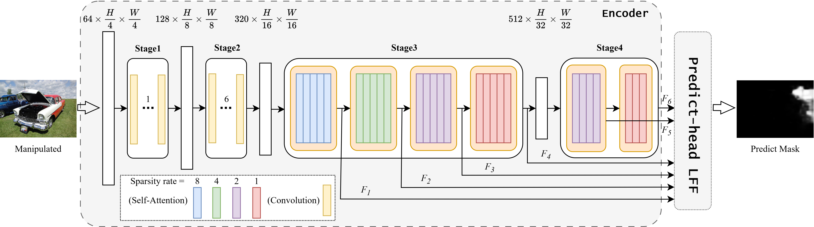

# Can We Get Rid of Handcrafted Feature Extractors? SparseViT: Nonsemantics-Centered, Parameter-Efficient Image Manipulation Localization through Spare-Coding Transformer

Official repository for the AAAI2025 paper  *Can We Get Rid of Handcrafted Feature Extractors? SparseViT: Nonsemantics-Centered, Parameter-Efficient Image Manipulation Localization through Spare-Coding Transformer* [[paper]](https://arxiv.org/abs/2412.14598) [[website]](https://github.com/scu-zjz/SparseViT).

<p float="left">
  
</p>

In summary, SparseViT leverages the distinction between semantic and non-semantic features, enabling the model to adaptively extract non-semantic features that are more critical for image manipulation localization. This provides a novel approach to precisely identifying manipulated regions.

## Dataset Preparation

<details>
  <summary>Dataset Preparation</summary>
  <br>
  (1) Since SparseViT was trained using the CAT-Net joint dataset, you need to download the combined dataset. The specific datasets include:

 - CASIA2.0
 - FantasticReality_v1
 - IMD_20  
 - tampCOCO

  （For more detailed information about the dataset, you can refer to CAT-Net.）

  (2) The organization of the dataset, we have defined two types of Dataset classes:

 - json_dataset, To retrieve the input images and their corresponding ground truth from a JSON file, the format would typically look like this:
```json
[
    [
        "/Dataset/CASIAv2/Tp/Tp_D_NRN_S_N_arc00013_sec00045_11700.jpg",
        "/Dataset/CASIAv2/Gt/Tp_D_NRN_S_N_arc00013_sec00045_11700_gt.png"
    ],
    [
        "/Dataset/CASIAv2/Au/Au_nat_30198.jpg",
        "Negative"
    ],
    ...
]
Note: "Negative" indicates a real image with no ground truth.
```
- mani_dataset，Automatically loads images and their corresponding ground truth pairs from a directory. The directory structure should include：

  Tp subdirectory（for storing input images）

  Gt subdirectory（for storing ground truth）

  File pairing is automatically completed using the os.listdir() function.

  An example of the organization of mani_dataset is provided in the /images directory.


(3) Combined dataset configuration, organize each dataset into a JSON file in the following format:

```json
[
    ["ManiDataset", "/mnt/data0/public_datasets/IML/CASIA2.0"],
    ["JsonDataset", "/mnt/data0/public_datasets/IML/FantasticReality_v1/FantasticReality.json"],
    ["ManiDataset", "/mnt/data0/public_datasets/IML/IMD_20_1024"],
    ["JsonDataset", "/mnt/data0/public_datasets/IML/tampCOCO/sp_COCO_list.json"],
    ["JsonDataset", "/mnt/data0/public_datasets/IML/tampCOCO/cm_COCO_list.json"],
    ["JsonDataset", "/mnt/data0/public_datasets/IML/tampCOCO/bcm_COCO_list.json"],
    ["JsonDataset", "/mnt/data0/public_datasets/IML/tampCOCO/bcmc_COCO_list.json"]
]
```
  Configure the path to the organized JSON file in the data_path parameter within the train.sh file.
</details>

## Train setup
<details>
  <summary>1) Set up the coding environment</summary>
  <br>

   - First, clone the repository:

  ```bash
git clone https://github.com/scu-zjz/SparseViT.git
  ```

  - Our environment

  ```
  Ubuntu LTS 20.04.1

  CUDA 11.5 + cudnn 8.4.0

  Python 3.10

  PyTorch 2.4
  ```

  - You should install the packages in [requirements.txt](https://github.com/scu-zjz/SparseViT/blob/main/requirements.txt) 

  ```bash
pip install -r requirements.txt
  ```

</details>

<details>
  <summary>2) Download the Uniformer pretrained weights</summary>
  <br>
  
  - Download the pretrained weights from [Google Drive](https://drive.google.com/file/d/1XPjAXhDS6nGNXb11VzgdNqEeM7X0p2t9/view?usp=drive_link) and place them in the checkpoint/train/pretrain directory.
  - Modify the pretrain_path in the train.sh file to the location of your Uniformer pre-trained model.
    
</details>

## Test setup

<details>
  <summary>1) Set up the coding environment</summary>
  <br>

  - Consistent with "train".


</details>

<details>
  <summary>2) Download our pretrained checkpoints</summary>
  <br>
  
  - Download our pretrained checkpoints from [Google Drive](https://drive.google.com/file/d/104BPPvLXkxuPu_NHaxjesdcdZ-ln92-G/view?usp=drive_link) and place them in the checkpoint/test directory.
    
</details>

## Scripts

This should be super easy! Simply run

 - For Train
```
sh train.sh
```

 - For Test
```
python main_test.py
```

Here we simply provide the basic training and testing for SparseViT. Of course, you can train and test SparseViT within our proposed [IMDL-BenCo](https://github.com/scu-zjz/IMDLBenCo) framework, as they are fully compatible.

## Citation

If you find our code useful, please consider citing us and give us a star! 

```
@inproceedings{su2025can,
  title={Can we get rid of handcrafted feature extractors? sparsevit: Nonsemantics-centered, parameter-efficient image manipulation localization through spare-coding transformer},
  author={Su, Lei and Ma, Xiaochen and Zhu, Xuekang and Niu, Chaoqun and Lei, Zeyu and Zhou, Ji-Zhe},
  booktitle={Proceedings of the AAAI Conference on Artificial Intelligence},
  volume={39},
  number={7},
  pages={7024--7032},
  year={2025}
}
```

## Star History
<a href="https://star-history.com/#scu-zjz/SparseViT&Date">
 <picture>
   <source media="(prefers-color-scheme: dark)" srcset="https://api.star-history.com/svg?repos=scu-zjz/SparseViT&type=Date&theme=dark" />
   <source media="(prefers-color-scheme: light)" srcset="https://api.star-history.com/svg?repos=scu-zjz/SparseViT&type=Date" />
   
 </picture>
</a>
